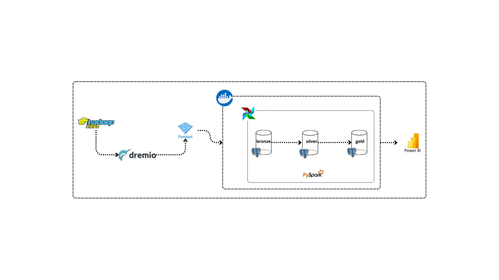

# 🚀 Data Pipeline Architecture for Data Quality and Storytelling  

This project, completed during my internship at Wafa Assurance Morocco, aims to test data quality and provide impactful visualizations through *data storytelling*.  
Due to the sensitivity of the actual data, a *dummy dataset* was used, although it is much smaller than the production data. As a result, transformations were performed using **Python** and **Pandas** instead of **PySpark**, while still maintaining the key steps of the data pipeline.
---

## 🏗️ Architecture Overview  

  

### Key Components and Workflow  

1. **Hadoop HDFS**  
   - The foundation for raw data storage.  
   - Handles large-scale datasets with distributed storage, ensuring high availability and durability.  

2. **Dremio**  
   - A unified data layer.  
   - Fetches raw data from Hadoop and converts it into Parquet format, enabling efficient data querying and exploration.  

3. **Docker**  
   - Containerization solution.  
   - Ensures consistent environments for all tools in the pipeline, from Dremio to Airflow and beyond.

4. **Apache Airflow**  
   - Orchestrates the data pipeline.  
   - Automates workflows like data ingestion, validation, and transformation, ensuring smooth pipeline execution.

5. **Data Lakehouse: Bronze → Silver → Gold**  
   - **Bronze Layer**: Raw data storage.  
   - **Silver Layer**: Data after initial validation and cleansing.  
   - **Gold Layer**: High-quality, business-ready data.  
   - Managed through PostgreSQL and enhanced by PySpark transformations.

6. **PySpark**  
   - Data processing powerhouse.  
   - Performs complex quality checks and applies transformations as data flows from raw to refined stages.

7. **Power BI**  
   - Visualization and storytelling tool.  
   - Creates interactive dashboards and **data stories** that transform raw numbers into meaningful narratives.  
   - Designed for two types of users:  
     - **Data Owner**.  
     - **Data Steward**.

---

## 🔍 Why Focus on Data Quality?  

In this data-driven world, **quality is everything**. Poor data quality leads to misleading insights, while high-quality data enables:  

- **Accurate Decision Making**: Ensure stakeholders have reliable insights.  
- **Operational Efficiency**: Reduce rework and manual cleaning efforts.  
- **Enhanced Trust**: Build confidence in data-driven strategies across teams.  

Our pipeline systematically validates data quality at each stage, ensuring only the most reliable data makes its way to the final layer.

---

## 🎯 Use Case: From Raw Data to Data Storytelling  

This pipeline enables businesses to:  
- Validate and improve the quality of data.  
- Gain insights from clean, enriched datasets.  
- Present these insights through **data storytelling**, allowing stakeholders to better understand trends, patterns, and actionable insights.  

---

## 📈 Tech Stack Highlights  

- **Data Storage**: Hadoop, PostgreSQL  
- **Orchestration**: Apache Airflow  
- **Processing**: PySpark  
- **Visualization**: Power BI for data storytelling  
- **Deployment**: Docker  

---

## 📊 Data Visualizations  

Below are some examples of the visualizations created using Power BI to present the insights derived from the processed data:

- **Dashboard 1**: Overview of key data trends and performance indicators.
  

- **Dashboard 2**: Detailed analysis of customer behavior and sales patterns.
  

- **Data Story**: An interactive storytelling visualization that highlights critical data insights.
  

## 💡 Conclusion  

This architecture isn't just about moving data—it's about **telling stories**. From ensuring data quality to crafting visually engaging narratives, this pipeline empowers organizations to leverage their data effectively and make impactful decisions.

