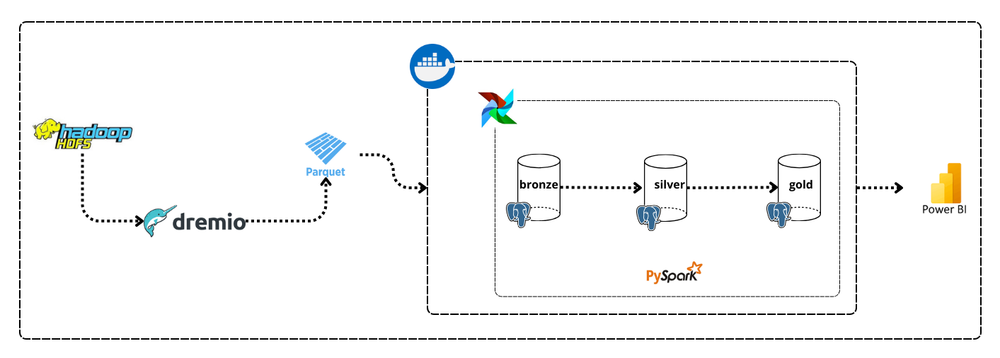
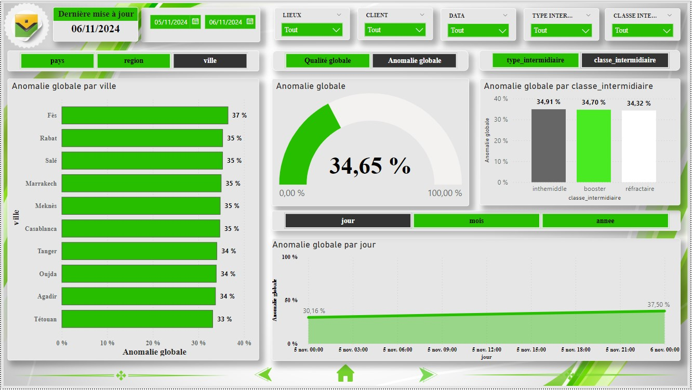

# 🚀 Data Pipeline Architecture for Data Quality and Storytelling  

This project, a simulation completed during my internship at Wafa Assurance Morocco, was designed to test data quality and deliver impactful visualizations through data storytelling. While the project is based on a real-world scenario, only a few adjustments were made for the purpose of this simulation.
A dummy dataset was used due to the sensitivity of the actual data, with the dummy dataset being significantly smaller than the production data. In this simulation, I used HDFS as the data source. However, in the actual project, multiple data sources were involved, including HDFS, SQL Server, Oracle DB, and more.
Data transformations were performed using Python and Pandas, rather than PySpark, while still adhering to the core steps of the data pipeline.

---

## 🏗️ Architecture Overview  

  

### Key Components and Workflow  

1. **Hadoop HDFS**  
   - The foundation for raw data storage.  
   - Handles large-scale datasets with distributed storage, ensuring high availability and durability.  

2. **Dremio**  
   - A unified data layer.  
   - Fetches raw data from Hadoop and converts it into Parquet format, enabling efficient data querying and exploration.  

3. **Docker**  
   - Containerization solution.  
   - Ensures consistent environments for all tools in the pipeline, from Dremio to Airflow and beyond.

4. **Apache Airflow**  
   - Orchestrates the data pipeline.  
   - Automates workflows like data ingestion, validation, and transformation, ensuring smooth pipeline execution.

5. **Data Lakehouse: Bronze → Silver → Gold**  
   - **Bronze Layer**: Raw data storage.  
   - **Silver Layer**: Data after initial validation and cleansing.  
   - **Gold Layer**: High-quality, business-ready data.  
   - Managed through PostgreSQL and enhanced by PySpark transformations.

6. **PySpark**  
   - Data processing powerhouse.  
   - Performs complex quality checks and applies transformations as data flows from raw to refined stages.

7. **Power BI**  
   - Visualization and storytelling tool.  
   - Creates interactive dashboards and **data stories** that transform raw numbers into meaningful narratives.  
   - Designed for two types of users:  
     - **Data Owner**.  
     - **Data Steward**.

---

## 🧪 Data Quality Tests

As part of the project, I performed several data quality tests across different dimensions, including **completeness**, **validity**, **coherence**, and **uniqueness**. For each dimension, I ran multiple tests on different types of data such as *names*, *first names*, and more. Here are the key tests conducted:

### 1. Completeness
Ensuring that all required fields were populated, with no missing or null values.

### 2. Validity
Verifying that the data follows predefined rules, such as valid date formats or correct ranges for numerical values.

### 3. Coherence
Checking for logical consistency within the data, such as ensuring that relationships between different fields (e.g., first name and last name) made sense.

### 4. Uniqueness

These tests helped identify and correct potential data quality issues, ensuring that the datasets were reliable for analysis and visualization.

---

## 📈 Tech Stack Highlights  

- **Data Storage**: Hadoop, PostgreSQL  
- **Orchestration**: Apache Airflow  
- **Processing**: PySpark  
- **Visualization**: Power BI for data storytelling  
- **Deployment**: Docker  

---

## 📈 Dashboard Overview  
### 📍 Visualization:  

## 🌐 How to Access  
You can view the live dashboard using the link below:  
👉 **[View the Dashboard](https://app.powerbi.com/reportEmbed?reportId=25549b4c-a936-4d2f-8b7e-af85599c0929&autoAuth=true&ctid=04d6a2f0-64b2-4e71-b348-646401d08ee8)**  

  
## 💡 Conclusion  

This architecture isn't just about moving data—it's about **telling stories**. From ensuring data quality to crafting visually engaging narratives, this pipeline empowers organizations to leverage their data effectively and make impactful decisions.

